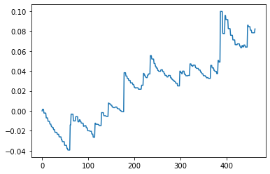

# Jquant

Jqaunt is a trading system for crypto currency currently. I hope it will support stocks, bonds, currencies, commodities, and all manner of derivative securities in future. 

## Getting Started

These instructions will get you a copy of the project up and running on your local machine for development and testing purposes. See deployment for notes on how to deploy the project on a live system.

### Prerequisites

What things you need to install the software and how to install them

- Install required libraries

```
pip install -r requirements.txt
```

- Install Ta-Lib

If you are using Windows and Python3.8. You can install the library like below

```
pip install TA_Lib-0.4.18-cp38-cp38-win_amd64.whl
```

## Running the back test

```
python main_test.py
```

You can use pandas to analyze the results.csv generated by the back test.




## Run in production

```
python main.py
```

## Versioning

For the versions available, see the [tags on this repository](https://github.com/thlynn/Jquant/tags). 

## License

This project is licensed under the MIT License - see the [LICENSE](LICENSE) file for details

